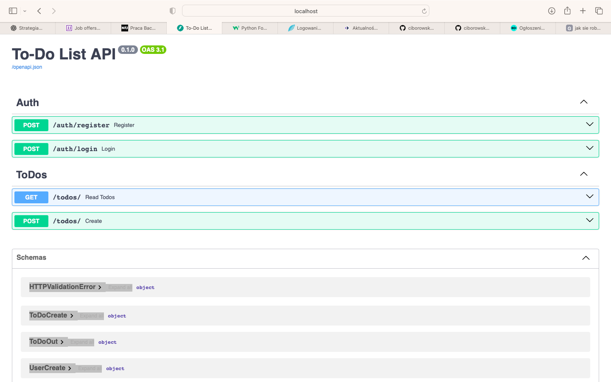

# ✅ To-Do List API

Prosty i szybki backend REST API dla aplikacji zarządzania zadaniami, zbudowany z użyciem **FastAPI**, **PostgreSQL**, **JWT**, **Docker** i **SQLAlchemy**.



## 🚀 Funkcje

- Rejestracja i logowanie użytkowników (JWT)
- CRUD dla zadań (To-Do)
- Oddzielne endpointy dla autoryzacji i zasobów
- Obsługa relacyjnych danych (zadania przypisane do użytkownika)
- Docker + Docker Compose do łatwego uruchomienia

---

## ⚙️ Technologie

- 🐍 Python 3.11
- ⚡ FastAPI
- 🐘 PostgreSQL
- 🔐 JWT (JSON Web Tokens)
- 🔧 SQLAlchemy + Alembic (migracje)
- 🐳 Docker / Docker Compose

---

## 📦 Instalacja lokalna

### 1. Klonowanie repozytorium

```bash
git clone https://github.com/ciborowskigrzegorz-bit/todo-api.git
cd todo-api
```

### 2. Uruchomienie za pomocą Docker Compose

```bash
docker-compose up --build
```

Aplikacja będzie dostępna pod adresem: [http://localhost:8000](http://localhost:8000)

Swagger UI: [http://localhost:8000/docs](http://localhost:8000/docs)

---

## 🔐 Uwierzytelnianie

Uwierzytelnianie odbywa się za pomocą tokena JWT.

- `POST /auth/register` – rejestracja użytkownika
- `POST /auth/login` – logowanie i zwrot tokena JWT

---

## 📋 Endpointy

| Metoda | Ścieżka             | Opis                        |
|--------|---------------------|-----------------------------|
| POST   | `/auth/register`    | Rejestracja użytkownika     |
| POST   | `/auth/login`       | Logowanie i JWT             |
| GET    | `/todos/`           | Lista zadań użytkownika     |
| POST   | `/todos/`           | Dodanie nowego zadania      |
| PUT    | `/todos/{id}`       | Edycja zadania              |
| DELETE | `/todos/{id}`       | Usunięcie zadania           |

---

## 📸 Zrzut ekranu

> 

---

## ✅ Przyszłe rozszerzenia

- Testy jednostkowe (pytest)
- Middleware do dekodowania JWT
- Paginacja i filtrowanie
- UI do testowania (np. React / Vue)

---

## 📝 Licencja

Projekt dostępny na licencji **MIT**. Używaj i rozwijaj!

---

## 🤝 Autor

Grzegorz Ciborowski  
📧 ciborowskigrzegorz@gmail.com  
🔗 [github.com/ciborowskigrzegorz-bit](https://github.com/ciborowskigrzegorz-bit/todo-api)# To-Do API
